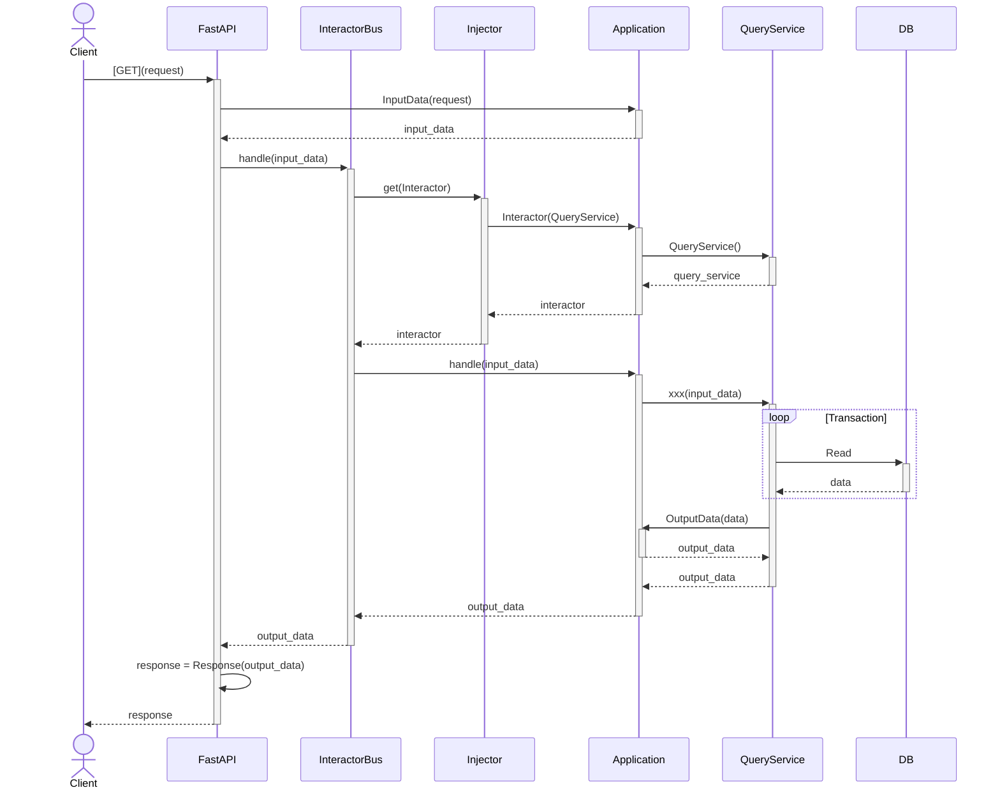
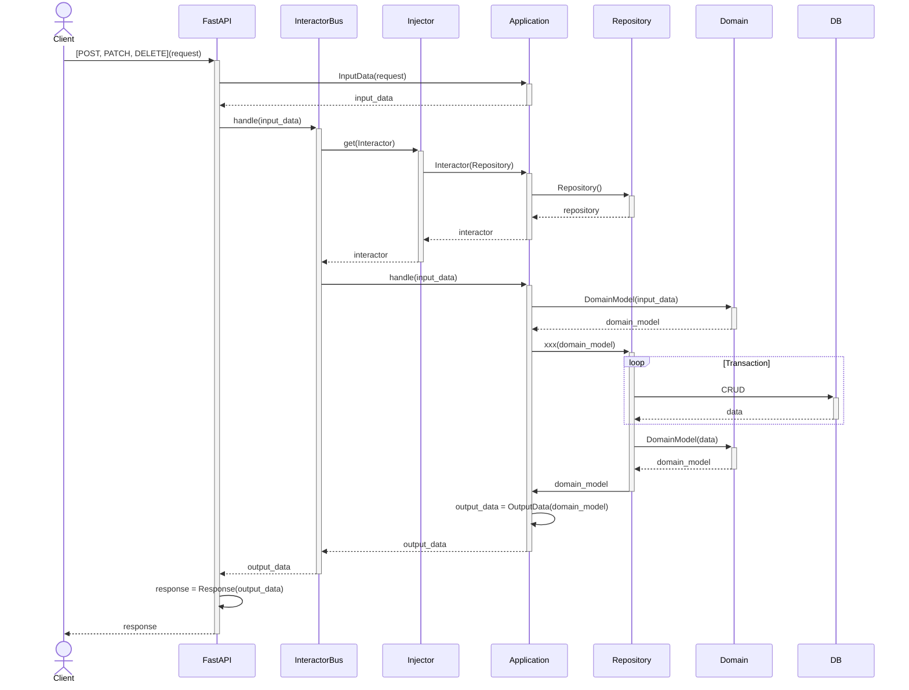
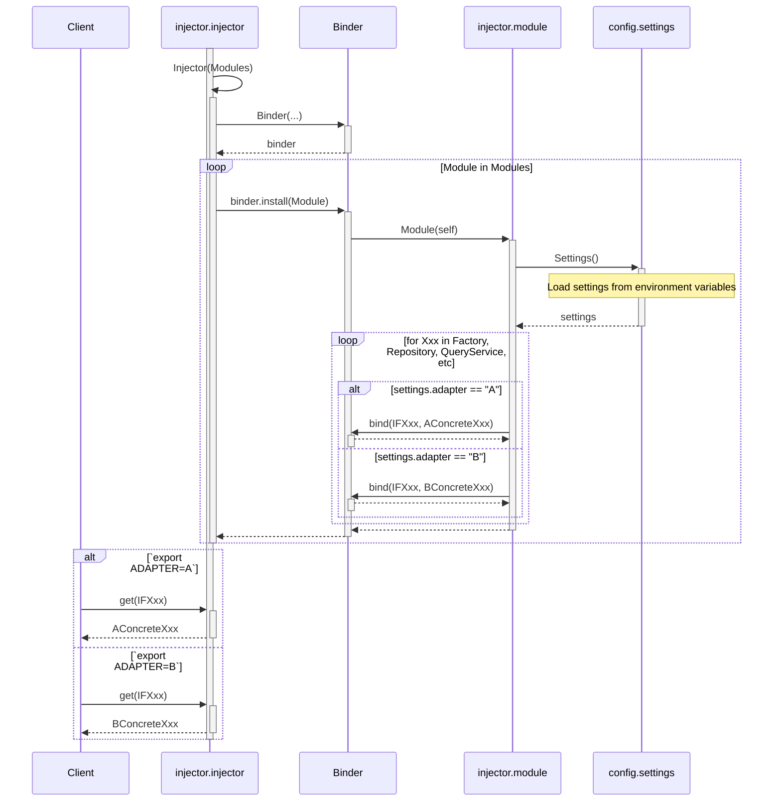

# Sequence Diagrams

## REST API

### GET

```mermaid
sequenceDiagram
    actor Client
    participant FastAPI
    participant Bus as InteractorBus
    participant Injector
    participant App as Application
    participant Query as QueryService
    participant DB

    Client ->>+ FastAPI: [GET](request)
        FastAPI ->>+ App: InputData(request)
        App -->>- FastAPI: input_data

        FastAPI ->>+ Bus: handle(input_data)
            Bus ->>+ Injector: get(Interactor)
                Injector ->>+ App: Interactor(QueryService)
                    App ->>+ Query: QueryService()
                    Query -->>- App: query_service
                App -->>- Injector: interactor
            Injector -->>- Bus: interactor

            Bus ->>+ App: handle(input_data)
                App ->>+ Query: xxx(input_data)
                    loop Transaction
                        Query ->>+ DB: Read
                        DB -->>- Query: data
                    end
                    Query ->>+ App: OutputData(data)
                    App -->>- Query: output_data
                Query -->>- App: output_data
            App -->>- Bus: output_data
        Bus -->>- FastAPI: output_data
        FastAPI ->> FastAPI: response = Response(output_data)
    FastAPI -->>- Client: response
```

### POST, PATCH, DELETE

```mermaid
sequenceDiagram
    actor Client
    participant FastAPI
    participant Bus as InteractorBus
    participant Injector
    participant App as Application
    participant Repo as Repository
    participant Domain
    participant DB

    Client ->>+ FastAPI: [POST, PATCH, DELETE](request)
        FastAPI ->>+ App: InputData(request)
        App -->>- FastAPI: input_data

        FastAPI ->>+ Bus: handle(input_data)
            Bus ->>+ Injector: get(Interactor)
                Injector ->>+ App: Interactor(Repository)
                    App ->>+ Repo: Repository()
                    Repo -->>- App: repository
                App -->>- Injector: interactor
            Injector -->>- Bus: interactor

            Bus ->>+ App: handle(input_data)
                App ->>+ Domain: DomainModel(input_data)
                Domain -->>- App: domain_model

                App ->>+ Repo: xxx(domain_model)
                    loop Transaction
                        Repo ->>+ DB: CRUD
                        DB -->>- Repo: data
                    end
                    Repo ->>+ Domain: DomainModel(data)
                    Domain -->>- Repo: domain_model
                Repo ->>- App: domain_model

                App ->> App: output_data = OutputData(domain_model)
            App -->>- Bus: output_data
        Bus -->>- FastAPI: output_data
        FastAPI ->> FastAPI: response = Response(output_data)
    FastAPI -->>- Client: response
```

## IoC Container

```mermaid
sequenceDiagram
    participant Client
    participant Injector as injector.injector
    participant Binder as Binder
    participant Module as injector.module
    participant Settings as config.settings

    activate Injector

    Injector ->> Injector: Injector(Modules)
        activate Injector
        Injector ->>+ Binder: Binder(...)
        Binder -->>- Injector: binder
        loop Module in Modules
            Injector ->>+ Binder: binder.install(Module)
                Binder ->>+ Module: Module(self)
                    Module ->>+ Settings: Settings()
                    Note over Settings: Load settings from environment variables 
                    Settings -->>- Module: settings
                    loop for Xxx in Factory, Repository, QueryService, etc
                        alt settings.adapter == "A"
                            Module ->>+ Binder: bind(IFXxx, AConcreteXxx)
                            Binder -->>- Module: 
                        else settings.adapter == "B"
                            Module ->>+ Binder: bind(IFXxx, BConcreteXxx)
                            Binder -->>- Module: 
                        end
                    end
                Module -->>- Binder: 
            Binder -->>- Injector: 
        end
        deactivate Injector

    alt `export ADAPTER=A`
        Client ->>+ Injector: get(IFXxx)
        Injector -->>- Client: AConcreteXxx
    else `export ADAPTER=B`
        Client ->>+ Injector: get(IFXxx)
        Injector -->>- Client: BConcreteXxx
    end

    deactivate Injector
```
